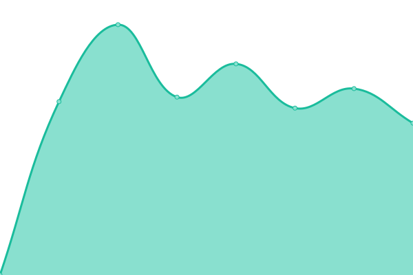
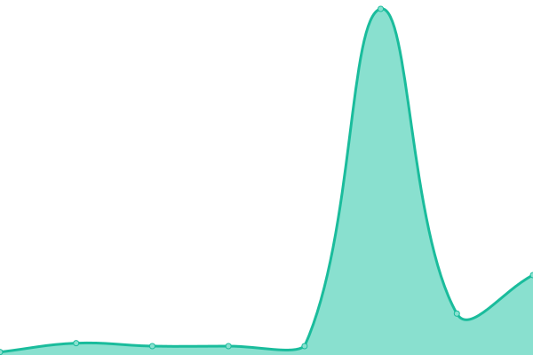
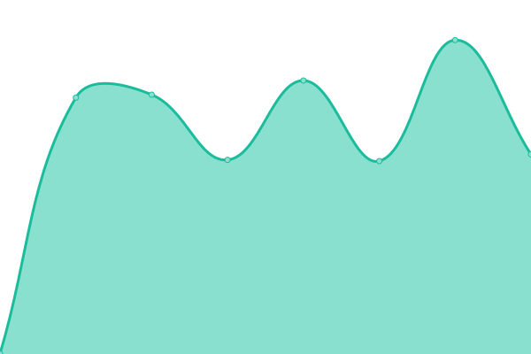
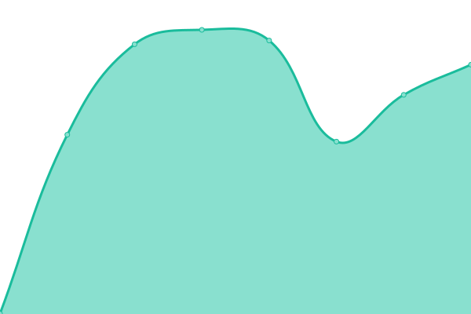
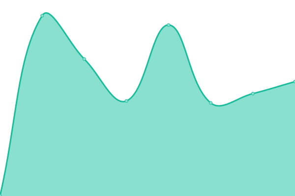
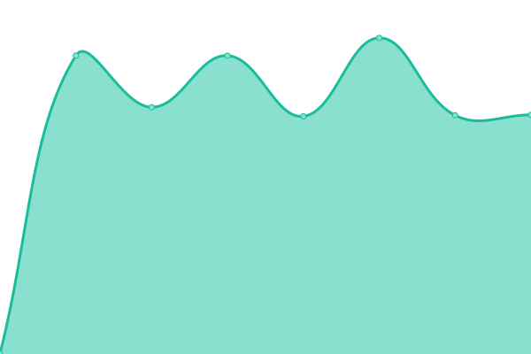
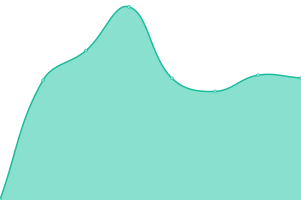
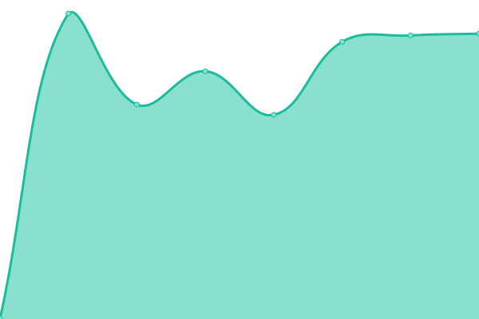

# [📈 Live Status](https://BAM-karaokebox.github.io/bam-upptime): <!--live status--> **🟩 All systems operational**

This repository contains the open-source uptime monitor and status page for [BAM-karaokebox](https://BAM-karaokebox.github.io/bam-upptime), powered by [Upptime](https://github.com/upptime/upptime).

With [Upptime](https://upptime.js.org), you can get your own unlimited and free uptime monitor and status page, powered entirely by a GitHub repository. We use [Issues](https://github.com/BAM-karaokebox/bam-upptime/issues) as incident reports, [Actions](https://github.com/BAM-karaokebox/bam-upptime/actions) as uptime monitors, and [Pages](https://BAM-karaokebox.github.io/bam-upptime) for the status page.

<!--start: status pages-->
<!-- This summary is generated by Upptime (https://github.com/upptime/upptime) -->
<!-- Do not edit this manually, your changes will be overwritten -->
<!-- prettier-ignore -->
| URL | Status | History | Response Time | Uptime |
| --- | ------ | ------- | ------------- | ------ |
|  [BAM Karaoke Box (web)](https://www.bam-karaokebox.com) | 🟩 Up | [bam-karaoke-box-web.yml](https://github.com/BAM-karaokebox/bam-upptime/commits/HEAD/history/bam-karaoke-box-web.yml) | 

 2524ms
     
 | 

<a href="https://BAM-karaokebox.github.io/bam-upptime/history/bam-karaoke-box-web">99.28%</a>
    

|  [BAM Karaoke Box Backend](https://backend.bam-karaokebox.com) | 🟩 Up | [bam-karaoke-box-backend.yml](https://github.com/BAM-karaokebox/bam-upptime/commits/HEAD/history/bam-karaoke-box-backend.yml) | 

 1083ms
     
 | 

<a href="https://BAM-karaokebox.github.io/bam-upptime/history/bam-karaoke-box-backend">99.30%</a>
    

|  [BAM Karaoke To Go](https://www.bam-karaoketogo.com) | 🟩 Up | [bam-karaoke-to-go.yml](https://github.com/BAM-karaokebox/bam-upptime/commits/HEAD/history/bam-karaoke-to-go.yml) | 

 815ms
     
 | 

<a href="https://BAM-karaokebox.github.io/bam-upptime/history/bam-karaoke-to-go">100.00%</a>
    

|  [BAM Karaoke Online](https://www.bam-karaokeonline.com) | 🟩 Up | [bam-karaoke-online.yml](https://github.com/BAM-karaokebox/bam-upptime/commits/HEAD/history/bam-karaoke-online.yml) | 

 10ms
     
 | 

<a href="https://BAM-karaokebox.github.io/bam-upptime/history/bam-karaoke-online">100.00%</a>
    

|  [BAM Karaoke Online (staging)](https://www.app.staging.bam-karaokeonline.com) | 🟩 Up | [bam-karaoke-online-staging.yml](https://github.com/BAM-karaokebox/bam-upptime/commits/HEAD/history/bam-karaoke-online-staging.yml) | 

 596ms
     
 | 

<a href="https://BAM-karaokebox.github.io/bam-upptime/history/bam-karaoke-online-staging">100.00%</a>
    

|  [The Songs Laboratory](https://www.thesongslaboratory.com) | 🟩 Up | [the-songs-laboratory.yml](https://github.com/BAM-karaokebox/bam-upptime/commits/HEAD/history/the-songs-laboratory.yml) | 

 253ms
     
 | 

<a href="https://BAM-karaokebox.github.io/bam-upptime/history/the-songs-laboratory">100.00%</a>
    

|  [TSL Pro](https://www.tslkaraoke.com) | 🟩 Up | [tsl-pro.yml](https://github.com/BAM-karaokebox/bam-upptime/commits/HEAD/history/tsl-pro.yml) | 

 651ms
     
 | 

<a href="https://BAM-karaokebox.github.io/bam-upptime/history/tsl-pro">100.00%</a>
    

|  [TSL Pro (staging)](https://www.app.staging.tslkaraoke.com) | 🟩 Up | [tsl-pro-staging.yml](https://github.com/BAM-karaokebox/bam-upptime/commits/HEAD/history/tsl-pro-staging.yml) | 

 644ms
     
 | 

<a href="https://BAM-karaokebox.github.io/bam-upptime/history/tsl-pro-staging">100.00%</a>
    

|  [TSL/BKO Backend API](https://backend.api.bam-karaokeonline.com) | 🟩 Up | [tsl-bko-backend-api.yml](https://github.com/BAM-karaokebox/bam-upptime/commits/HEAD/history/tsl-bko-backend-api.yml) | 

 563ms
     
 | 

<a href="https://BAM-karaokebox.github.io/bam-upptime/history/tsl-bko-backend-api">100.00%</a>
    

|  [TSL/BKO Backend API (staging)](https://backend.api.staging.bam-karaokeonline.com) | 🟩 Up | [tsl-bko-backend-api-staging.yml](https://github.com/BAM-karaokebox/bam-upptime/commits/HEAD/history/tsl-bko-backend-api-staging.yml) | 

 588ms
     
 | 

<a href="https://BAM-karaokebox.github.io/bam-upptime/history/tsl-bko-backend-api-staging">100.00%</a>
    

|  [TSL/BKO Liana API](https://forest.api.bam-karaokeonline.com) | 🟩 Up | [tsl-bko-liana-api.yml](https://github.com/BAM-karaokebox/bam-upptime/commits/HEAD/history/tsl-bko-liana-api.yml) | 

 552ms
     
 | 

<a href="https://BAM-karaokebox.github.io/bam-upptime/history/tsl-bko-liana-api">100.00%</a>
    

|  [TSL/BKO Liana API (staging)](https://forest.api.staging.bam-karaokeonline.com) | 🟩 Up | [tsl-bko-liana-api-staging.yml](https://github.com/BAM-karaokebox/bam-upptime/commits/HEAD/history/tsl-bko-liana-api-staging.yml) | 

 574ms
     
 | 

<a href="https://BAM-karaokebox.github.io/bam-upptime/history/tsl-bko-liana-api-staging">100.00%</a>
    

|  [PallyCon Multi-DRM Licence Manager](https://license.pallycon.com/ri/licenseManager.do) | 🟩 Up | [pally-con-multi-drm-licence-manager.yml](https://github.com/BAM-karaokebox/bam-upptime/commits/HEAD/history/pally-con-multi-drm-licence-manager.yml) | 

 729ms
     
 | 

<a href="https://BAM-karaokebox.github.io/bam-upptime/history/pally-con-multi-drm-licence-manager">100.00%</a>
    

<!--end: status pages-->

[**Visit our status website →**](https://BAM-karaokebox.github.io/bam-upptime)

## 📄 License

- Powered by: [Upptime](https://github.com/upptime/upptime)
- Code: [MIT](./LICENSE) © [BAM-karaokebox](https://BAM-karaokebox.github.io/bam-upptime)
- Data in the `./history` directory: [Open Database License](https://opendatacommons.org/licenses/odbl/1-0/)
