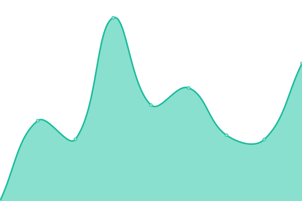
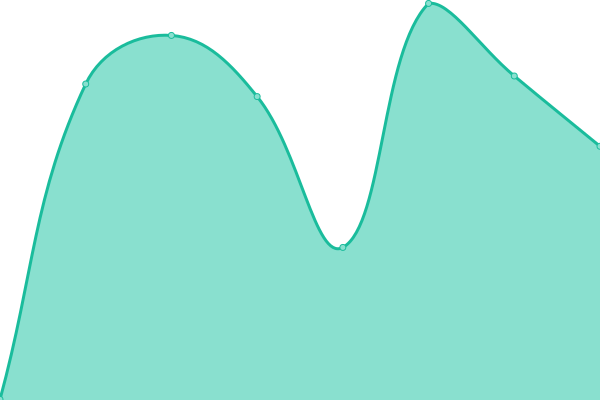
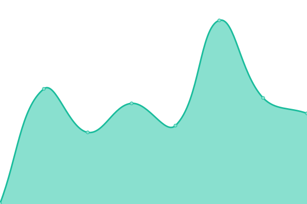
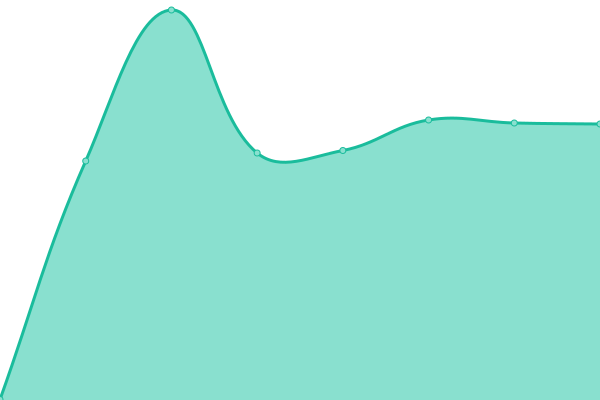

# [📈 Live Status](https://BAM-karaokebox.github.io/bam-upptime): <!--live status--> **🟩 All systems operational**

This repository contains the open-source uptime monitor and status page for [BAM-karaokebox](https://BAM-karaokebox.github.io/bam-upptime), powered by [Upptime](https://github.com/upptime/upptime).

With [Upptime](https://upptime.js.org), you can get your own unlimited and free uptime monitor and status page, powered entirely by a GitHub repository. We use [Issues](https://github.com/BAM-karaokebox/bam-upptime/issues) as incident reports, [Actions](https://github.com/BAM-karaokebox/bam-upptime/actions) as uptime monitors, and [Pages](https://BAM-karaokebox.github.io/bam-upptime) for the status page.

<!--start: status pages-->
<!-- This summary is generated by Upptime (https://github.com/upptime/upptime) -->
<!-- Do not edit this manually, your changes will be overwritten -->
<!-- prettier-ignore -->
| URL | Status | History | Response Time | Uptime |
| --- | ------ | ------- | ------------- | ------ |
|  [BKB / BAM Karaoke Box / Website](https://www.bam-karaokebox.com) | 🟩 Up | [bkb-bam-karaoke-box-website.yml](https://github.com/BAM-karaokebox/bam-upptime/commits/HEAD/history/bkb-bam-karaoke-box-website.yml) | 

 2483ms
     
 | 

<a href="https://BAM-karaokebox.github.io/bam-upptime/history/bkb-bam-karaoke-box-website">100.00%</a>
    

|  [BKB / BAM Karaoke Box / Website FR](https://fr.bam-karaokebox.com) | 🟩 Up | [bkb-bam-karaoke-box-website-fr.yml](https://github.com/BAM-karaokebox/bam-upptime/commits/HEAD/history/bkb-bam-karaoke-box-website-fr.yml) | 

 790ms
     
 | 

<a href="https://BAM-karaokebox.github.io/bam-upptime/history/bkb-bam-karaoke-box-website-fr">100.00%</a>
    

|  [BKB / BAM Karaoke Box / Website ES](https://es.bam-karaokebox.com) | 🟩 Up | [bkb-bam-karaoke-box-website-es.yml](https://github.com/BAM-karaokebox/bam-upptime/commits/HEAD/history/bkb-bam-karaoke-box-website-es.yml) | 

 1403ms
     
 | 

<a href="https://BAM-karaokebox.github.io/bam-upptime/history/bkb-bam-karaoke-box-website-es">100.00%</a>
    

|  [BKB / BAM Karaoke Box / Website EN](https://en.bam-karaokebox.com) | 🟩 Up | [bkb-bam-karaoke-box-website-en.yml](https://github.com/BAM-karaokebox/bam-upptime/commits/HEAD/history/bkb-bam-karaoke-box-website-en.yml) | 

 1591ms
     
 | 

<a href="https://BAM-karaokebox.github.io/bam-upptime/history/bkb-bam-karaoke-box-website-en">100.00%</a>
    

|  [BKB / BAM Karaoke Box / Website FR / Booking (Paris)](https://fr.bam-karaokebox.com/booking?city=Paris) | 🟩 Up | [bkb-bam-karaoke-box-website-fr-booking-paris.yml](https://github.com/BAM-karaokebox/bam-upptime/commits/HEAD/history/bkb-bam-karaoke-box-website-fr-booking-paris.yml) | 

 825ms
     
 | 

<a href="https://BAM-karaokebox.github.io/bam-upptime/history/bkb-bam-karaoke-box-website-fr-booking-paris">100.00%</a>
    

|  [BKB / BAM Karaoke Box / Website FR / Booking (Bordeaux)](https://fr.bam-karaokebox.com/booking?city=Bordeaux) | 🟩 Up | [bkb-bam-karaoke-box-website-fr-booking-bordeaux.yml](https://github.com/BAM-karaokebox/bam-upptime/commits/HEAD/history/bkb-bam-karaoke-box-website-fr-booking-bordeaux.yml) | 

 762ms
     
 | 

<a href="https://BAM-karaokebox.github.io/bam-upptime/history/bkb-bam-karaoke-box-website-fr-booking-bordeaux">100.00%</a>
    

|  [BKB / BAM Karaoke Box / Website FR / Booking (Madrid)](https://fr.bam-karaokebox.com/booking?city=Madrid) | 🟩 Up | [bkb-bam-karaoke-box-website-fr-booking-madrid.yml](https://github.com/BAM-karaokebox/bam-upptime/commits/HEAD/history/bkb-bam-karaoke-box-website-fr-booking-madrid.yml) | 

 269ms
     
 | 

<a href="https://BAM-karaokebox.github.io/bam-upptime/history/bkb-bam-karaoke-box-website-fr-booking-madrid">100.00%</a>
    

|  [BKB / BAM Karaoke Box / Backoffice](https://backend.bam-karaokebox.com) | 🟩 Up | [bkb-bam-karaoke-box-backoffice.yml](https://github.com/BAM-karaokebox/bam-upptime/commits/HEAD/history/bkb-bam-karaoke-box-backoffice.yml) | 

 1150ms
     
 | 

<a href="https://BAM-karaokebox.github.io/bam-upptime/history/bkb-bam-karaoke-box-backoffice">100.00%</a>
    

|  [BKB / BAM Karaoke To Go](https://www.bam-karaoketogo.com) | 🟩 Up | [bkb-bam-karaoke-to-go.yml](https://github.com/BAM-karaokebox/bam-upptime/commits/HEAD/history/bkb-bam-karaoke-to-go.yml) | 

 758ms
     
 | 

<a href="https://BAM-karaokebox.github.io/bam-upptime/history/bkb-bam-karaoke-to-go">100.00%</a>
    

|  [BKB / BAM Karaoke Online](https://www.bam-karaokeonline.com) | 🟩 Up | [bkb-bam-karaoke-online.yml](https://github.com/BAM-karaokebox/bam-upptime/commits/HEAD/history/bkb-bam-karaoke-online.yml) | 

 11ms
     
 | 

<a href="https://BAM-karaokebox.github.io/bam-upptime/history/bkb-bam-karaoke-online">100.00%</a>
    

|  [BKB / BAM Karaoke Online (preproduction)](https://www.app.preprod.bam-karaokeonline.com) | 🟩 Up | [bkb-bam-karaoke-online-preproduction.yml](https://github.com/BAM-karaokebox/bam-upptime/commits/HEAD/history/bkb-bam-karaoke-online-preproduction.yml) | 

 587ms
     
 | 

<a href="https://BAM-karaokebox.github.io/bam-upptime/history/bkb-bam-karaoke-online-preproduction">100.00%</a>
    

|  [BKB / BAM Karaoke Online (staging)](https://www.app.staging.bam-karaokeonline.com) | 🟩 Up | [bkb-bam-karaoke-online-staging.yml](https://github.com/BAM-karaokebox/bam-upptime/commits/HEAD/history/bkb-bam-karaoke-online-staging.yml) | 

 593ms
     
 | 

<a href="https://BAM-karaokebox.github.io/bam-upptime/history/bkb-bam-karaoke-online-staging">100.00%</a>
    

|  [TSL / The Songs Laboratory](https://www.thesongslaboratory.com) | 🟩 Up | [tsl-the-songs-laboratory.yml](https://github.com/BAM-karaokebox/bam-upptime/commits/HEAD/history/tsl-the-songs-laboratory.yml) | 

 259ms
     
 | 

<a href="https://BAM-karaokebox.github.io/bam-upptime/history/tsl-the-songs-laboratory">100.00%</a>
    

|  [TSL / TSL Karaoke](https://www.tslkaraoke.com) | 🟩 Up | [tsl-tsl-karaoke.yml](https://github.com/BAM-karaokebox/bam-upptime/commits/HEAD/history/tsl-tsl-karaoke.yml) | 

 543ms
     
 | 

<a href="https://BAM-karaokebox.github.io/bam-upptime/history/tsl-tsl-karaoke">100.00%</a>
    

|  [TSL / TSL Karaoke (preproduction)](https://www.app.preprod.tslkaraoke.com) | 🟩 Up | [tsl-tsl-karaoke-preproduction.yml](https://github.com/BAM-karaokebox/bam-upptime/commits/HEAD/history/tsl-tsl-karaoke-preproduction.yml) | 

 573ms
     
 | 

<a href="https://BAM-karaokebox.github.io/bam-upptime/history/tsl-tsl-karaoke-preproduction">100.00%</a>
    

|  [TSL / TSL Karaoke (staging)](https://www.app.staging.tslkaraoke.com) | 🟩 Up | [tsl-tsl-karaoke-staging.yml](https://github.com/BAM-karaokebox/bam-upptime/commits/HEAD/history/tsl-tsl-karaoke-staging.yml) | 

 575ms
     
 | 

<a href="https://BAM-karaokebox.github.io/bam-upptime/history/tsl-tsl-karaoke-staging">100.00%</a>
    

|  [TSL / TSL Platform / Backend API](https://backend.api.bam-karaokeonline.com) | 🟩 Up | [tsl-tsl-platform-backend-api.yml](https://github.com/BAM-karaokebox/bam-upptime/commits/HEAD/history/tsl-tsl-platform-backend-api.yml) | 

 562ms
     
 | 

<a href="https://BAM-karaokebox.github.io/bam-upptime/history/tsl-tsl-platform-backend-api">100.00%</a>
    

|  [TSL / TSL Platform / Backend API (preproduction)](https://backend.api.preprod.bam-karaokeonline.com) | 🟩 Up | [tsl-tsl-platform-backend-api-preproduction.yml](https://github.com/BAM-karaokebox/bam-upptime/commits/HEAD/history/tsl-tsl-platform-backend-api-preproduction.yml) | 

 505ms
     
 | 

<a href="https://BAM-karaokebox.github.io/bam-upptime/history/tsl-tsl-platform-backend-api-preproduction">100.00%</a>
    

|  [TSL / TSL Platform / Backend API (staging)](https://backend.api.staging.bam-karaokeonline.com) | 🟩 Up | [tsl-tsl-platform-backend-api-staging.yml](https://github.com/BAM-karaokebox/bam-upptime/commits/HEAD/history/tsl-tsl-platform-backend-api-staging.yml) | 

 515ms
     
 | 

<a href="https://BAM-karaokebox.github.io/bam-upptime/history/tsl-tsl-platform-backend-api-staging">100.00%</a>
    

|  [TSL / TSL Platform / Liana API](https://forest.api.bam-karaokeonline.com) | 🟩 Up | [tsl-tsl-platform-liana-api.yml](https://github.com/BAM-karaokebox/bam-upptime/commits/HEAD/history/tsl-tsl-platform-liana-api.yml) | 

 505ms
     
 | 

<a href="https://BAM-karaokebox.github.io/bam-upptime/history/tsl-tsl-platform-liana-api">100.00%</a>
    

|  [TSL / TSL Platform / Liana API (preproduction)](https://forest.api.preprod.bam-karaokeonline.com) | 🟩 Up | [tsl-tsl-platform-liana-api-preproduction.yml](https://github.com/BAM-karaokebox/bam-upptime/commits/HEAD/history/tsl-tsl-platform-liana-api-preproduction.yml) | 

 501ms
     
 | 

<a href="https://BAM-karaokebox.github.io/bam-upptime/history/tsl-tsl-platform-liana-api-preproduction">100.00%</a>
    

|  [TSL / TSL Platform / Liana API (staging)](https://forest.api.staging.bam-karaokeonline.com) | 🟩 Up | [tsl-tsl-platform-liana-api-staging.yml](https://github.com/BAM-karaokebox/bam-upptime/commits/HEAD/history/tsl-tsl-platform-liana-api-staging.yml) | 

 508ms
     
 | 

<a href="https://BAM-karaokebox.github.io/bam-upptime/history/tsl-tsl-platform-liana-api-staging">100.00%</a>
    

|  [TSL / PallyCon / Multi-DRM Licence Manager](https://license.pallycon.com/ri/licenseManager.do) | 🟩 Up | [tsl-pally-con-multi-drm-licence-manager.yml](https://github.com/BAM-karaokebox/bam-upptime/commits/HEAD/history/tsl-pally-con-multi-drm-licence-manager.yml) | 

 767ms
     
 | 

<a href="https://BAM-karaokebox.github.io/bam-upptime/history/tsl-pally-con-multi-drm-licence-manager">100.00%</a>
    

<!--end: status pages-->

[**Visit our status website →**](https://BAM-karaokebox.github.io/bam-upptime)

## 📄 License

- Powered by: [Upptime](https://github.com/upptime/upptime)
- Code: [MIT](./LICENSE) © [BAM-karaokebox](https://BAM-karaokebox.github.io/bam-upptime)
- Data in the `./history` directory: [Open Database License](https://opendatacommons.org/licenses/odbl/1-0/)
